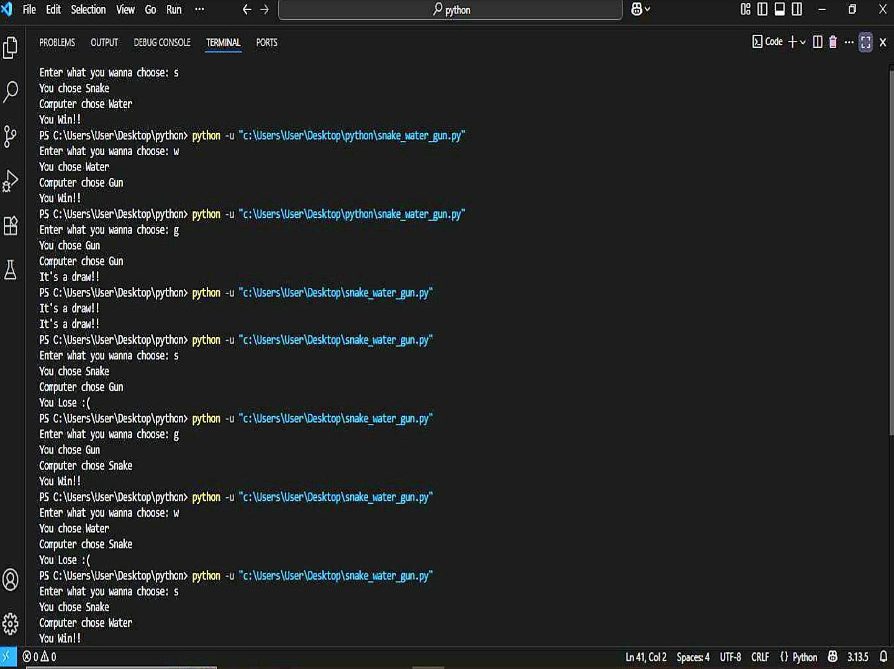

# 🐍 Snake Water Gun — Python Terminal Game

Welcome to a fun and simple Python project that recreates the classic childhood game **"Snake, Water, Gun"** — a desi twist on **Rock, Paper, Scissors**!

---

## 🎮 Gameplay Overview

This is a terminal-based game where:
- You play **10 rounds** against the computer
- Each player picks one:  
  - 🐍 Snake (`s`)  
  - 💧 Water (`w`)  
  - 🔫 Gun (`g`)
- The winner of each round is decided using traditional game logic:
  - Snake drinks Water ✅  
  - Gun shoots Snake ✅  
  - Water douses Gun ✅

---

## 📌 Key Features

- 🎲 **Randomized computer choice**
- 🧠 **Score tracking** across rounds
- 🛑 **Input validation** for smoother experience
- 🏁 **Final result** with winner declaration

---

## 🛠️ Tech Stack

| Language | Module Used |
|----------|--------------|
| Python  | `random` |

---
## 📚 What I Learned

- How to use `random` module
- Basic conditionals and loops
- Writing user-friendly CLI programs
- Pushing a project to GitHub!

---
## 🧪 Tested On

- ✅ Windows 11 (Python 3.10)
- ✅ Android using Pydroid3
- ✅ VS Code / GitHub Desktop

---
## 🔍 How It Works

1. Computer randomly selects between Snake, Water, or Gun using `random.choice()`
2. Player inputs their move (`s`, `w`, or `g`)
3. The winner is decided based on:
   - Snake drinks Water
   - Gun shoots Snake
   - Water douses Gun
---
## 🎮 Demo

Here’s what the Snake-Water-Gun game looks like in action:



---

## 🚀 How to Run

1. **Clone the repository**  
   ```bash
   git clone https://github.com/Mahak1311/snake-water-gun-python.git
